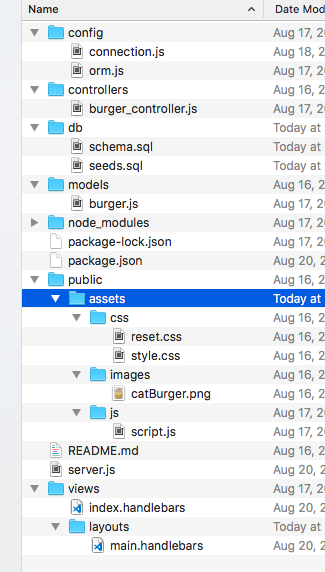
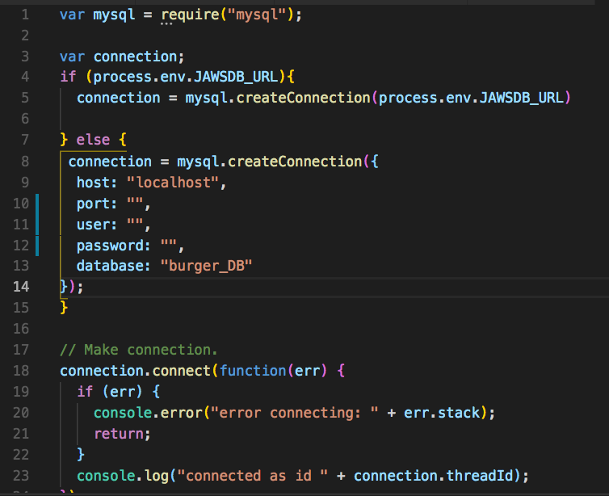
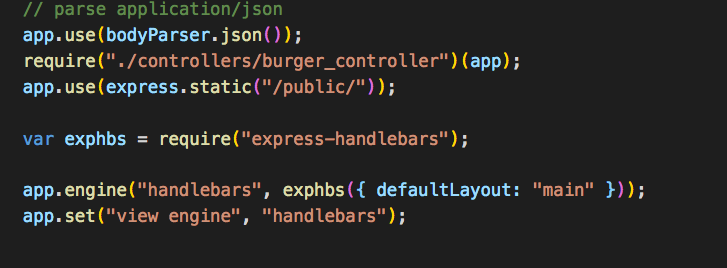

# Burgertown

[Try it here](https://murmuring-springs-22183.herokuapp.com/)

This project uses mysql as the database, node.js as the server, and some JavaScript for the logic and functionality of the site. You can try the application in realtime on heroku using the link above. 

## Getting Started
After creating your file structure, and creating your package.json, use NPM Install to create the proper environment for the application. ready. Please copy from the package.json all of the dependencies need to run this program accurately.  From your command line/terminal, use the command $ npm install.

## Prerequisites
When you run the command `$ npm install` from your terminal window/command line, you will immediately download the required prerequisites for this application to run.  The node modules and npm packages you need for this project are:

* Express: "^4.13.3"
* Express-Handlebars: "^2.0.1"
* Mysql :"^2.10.2"
* Body-Parser: "^1.14.2"
* for devDependencies, include "handlebars-helper-css": "^0.1.0"

## Installing
### Step 1 
The first set is connecting making your file structure.

The second step is understand the file structure and what it does. 

Here's a quick explanation of what each file does. 
* Config - this connects to the mysql database. The ORM file drives the commands to the database so that your site can interact with the persisted data. 

* Controllers - this is where all of your routes live. These are the different pages of your website. The controller interacts with the server and it makes it so your site visitors won't see the file extension. For example, when you create a local index.html file on your computer, you'll see the extension, ".html" on the page. When you set your routes using express, you won't have to include the ".html" file name. If you've ever been on the internet, you'll notice that most (if not all) URL's do not have a filename extension. 

* db - this is your database. These files will create your database and be be the inital input data. Including a database allows you to retain, add, manipulate and persist the data you collect from users.  The seeds.sql file is your dummy data so that you know your connected to your database. The schema is the configuration of your database. 

* models - this file is the logic behind your application. It uses the ORM file to execute the functions. The burger.js file tells the ORM what information/logic to input or exact from the database depending on the command from the user. The ORM uses the connection file to stay connected to the database. 

* node_modules - this is all of the extra files needed to support the dependencies. These files help express, handlebars, mysql, and body-parser run. That's all you need to know about this file. You should add node_modules to your `.gitignore` file because you don't want them attached to your git. Let's just end there. If you have questions about this, feel free to email me and I'll explain further. 

* package.json - this file coordinates all your dependencies. So when you decide to replicate a project like this, you can do it easily with an npm install. npm knows to look at this file to learn what dependencies you need from npm. If you're building a project from scratch use the command npm init and make sure to name yourself as the author. Then this file will automatically update as you add npm dependencies. 

* public - this holds all of your css, images and on-click related javascript.

* server.js - this file brings everything together. It's the brains behind everything. Everything must talk to this file. 

* views - this file contains all of your handlebars and HTML. This file interacts with your public file through your server.js file. 

### Step 2

Connecting the files. I'm assuming here that you have already have some HTML created and some CSS to go with your files.

You'll want to make sure your server.js file is set and listening to a PORT. Use this code below and then run the command node server.js in your command line. The console log will let you know if your sever is up and running. 

`var express = require('express');`
`var app = express();
var PORT = process.env.PORT || 3000;`
`app.listen(process.env.PORT || 3000);
console.log("listening to PORT"+ PORT);`

The code above gives you access to localhost 3000. It also makes the port a variable, which is needed if you decide to run this program on heroku. It allows heroku to run your program on any port, if port 3000 is already occupied. When you run the command `node server.js` in the command line (while you are in this folder), you should see this response:
`listening to PORT3000`
This means you've successfully connect to the server.

### Step 3
Next, go to MAMP and make sure your server is running. Then connect to mysql workbench. Use the code in your schema.sql to set up the database. Execute that code by highlighting it and pressing the lightning bolt in upper left corner.
Now it's time to connect with mysql. 
Make sure your database is running. I'm using MAMP and Mysql Workbench. Then add the following code to your connections.js file.  The console.log will tell you if you connected when you restart your server (via node server.js from command line). 

### Step 4 

Save your work, and keep your MAMP server running. Now restart your program and see if you get the console.log with the connectionthreadid. If you do, then you have successfully connected your database with your website!

### Step 5

Now it's time to set up your ORM. This file takes in the commands from your models folder and puts it into a form/template that mysql understands. It sets up the question marks, parentheses, quotation marks and the commands that mysql understands so that your logic in burger.js will be understoon by mysql. I would copy it directly. The most important part is to remember to connect the connections.js file here because that is your connection to the database. 

### Step 6

Now that our ORM file is created it's time to create the Buger.js file in our models folder. This is our logic behind the functionality of our site. You need a working and imported ORM before starting this part. Our three functions are: All (list of all of the burgers), Create (makes a new burger), and Update (for the devoured burgers). Since this file works with mysql, you will need to import the ORM as a variable and use it in all of the functions. These functions hang-off the orm. You'll see that the all function is "orm.all", and create is "orm.create". 

### Step 7 

Here's where the magic happens! 
Now that we have access to our data, we can play with it, and we can now bring it to the client. At the bottom of the Burger.js file, you'll notice module.exports = burger. You now want to import that data (that's coming through mysql, the orm and finally the logic of the models file to your controller.js file. This way, you can disseminate the information on your various routes in your web application. 

At the top of your controller.js file, you must require the models/burger.js file in addition to the npm "path". This automatically comes with node, so there's no need to download a verson of it with npm. 

This file directs where the information coming from the database and information coming from the user should go. Essentially, this file helps the front and back ends speak to each other. 

As you should remember from step 6, we created 3 functions: all, create, and update. Those three functions coordinate with the three CRUD calls we're making in our controller.js. Those actions are `GET`, `POST` and `PUT` respectively. The get call brings forth all the information from the backend and the static html, and css files. The post call adds a completely new burger to the website and database. The put function updates an existing burger (in this scenario, it would be a devoured burger). 

Since we have not implemented our handlebars template yet, it will be hard to test if this is working yet. 

### Step 8

In this step, we're going to update the assets for the client in the public folder as well as in the views folder. Simply add your assets and your css to the folder as you typically would when building a webpage. 

The javascript file is important here. It handles two "on click" functions. The `$("#submit")on("click"` function call links to the html in your index.handlebars file. When the submit button is click (it has an id of "submit"), the click tells the application to do a post. And your controller.js file will then post the new burger to the webpage in addition to adding it to the database. I used jQuery to make this happen. 

After that, a burger is dynamically added to the webpage and the database. It comes with a "devour" function. This on click event is on the document object. This is because the actual button is not hardcoded into the html like our submit button. Since its not hardcoded into the page, we have to click on something that is. That is why we're clicking onto the document. 

Let's move into your handlebars folder. Right now we're going to focus on the index.Handlebars file. This file is unique because it allows you some javascript functionality. It gives you the ability to implement True/False statements with it's {{#if}} and {{#unless}} functions. It also allows you to apply the same functionality and styling to multiple elements with the {{#each}} function. 

For every burger we made in the burger.js file in the models folder, we gave it two data points. Each burger has a name, and a boolean of devoured. Every new burger is has set devoured to false(the thought is that you just made the burger and you have not had time to consume it).

The #unless is the equivalent to false (not devoured) and we will list the names of the uneaten burgers in that section of the webpage. Our #if is the equivalent to true (devoured) and our devoured burgers will now be listed in this section of the webpage. 

In our main.handlebars section, we will set the html and css for the entire page. Then implement {{{body}}} to tell handlebars where to put the index.handlebars html and css. 

### Step 9

We're almost finished here! Now we have to connect our handlebars and our controller.js files to our server.js file. This brings our application full-circle. 
Here's the code you need to do it.

## Deployment
Here are some great guides to deploying this application on heroku, and jawDB (a free database to use in place of mysql). 

## Versioning
This is the first version of the second version of this project. 

## Authors
Megan Anthony Keogh

## License
This is an unlicensed project. 

## Acknowledgments
I would like to acknowledge Ed Brennan from the University of Pennsylvania for tirelessly working with me to build this application. This project would not be possible without his guidance and patience. 

